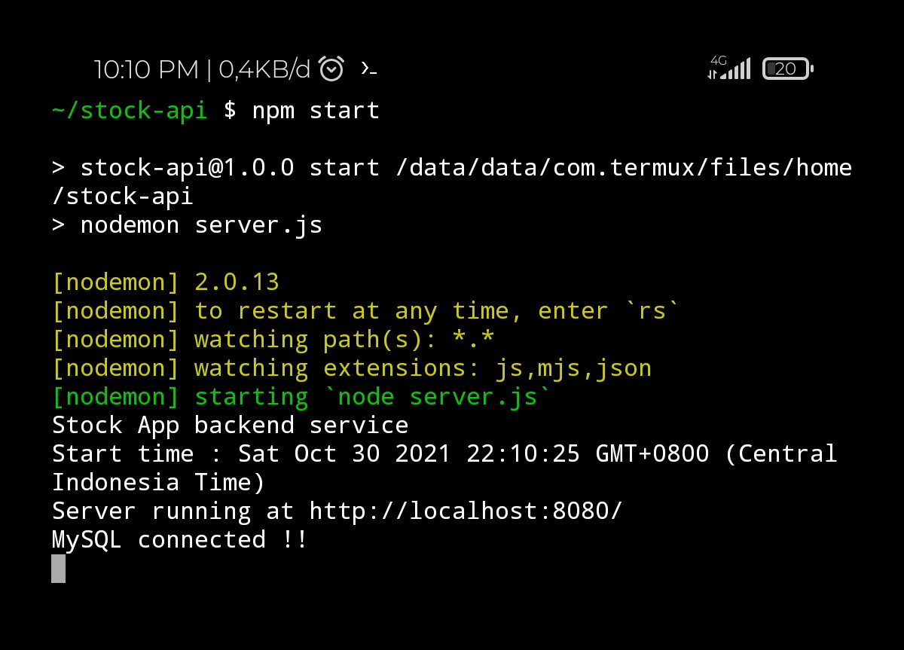

<h3 align="center">Stock API</h3>
<p align="center">Aplication Backend For Stock App</p>

### About
This application is used to serve data requests from the Stock-App client application to the server. 
Built with Node JS, Express JS and MySql

### Dependencies
- body parser v.1.19.0
- cors v.2.8.5
- express v.4.17.1
- express fileupload v.1.2.1
- md5 v.2.3.0
- mysql v.2.18.1
- random token v.0.0.8
- nodemon 2.0.13

### How to start
- Use this command for cloning this repository <code>git clone https://github.com/or-abdillh/stock-api.git</code>
- Then, use this command <code>cd stock-api</code>
- Install all dependencies <code>npm install</code>

### Running The Server
- Make sure you have exported the database using this file <code>./DB/stockAppDB.sql</code>
- Running the mysql services if you use mysql CLI with this command <code>mysqld_safe</code>
- Before running the server you must setup the configuration connection to your mysql in <code>./connection/conn.js</code>
- Then, use this command to run server <code>npm start</code>
- By default the server running on PORT 8080, you can change the PORT in <code>./server.js</code>


### Hostname & Endpoint API
- HOSTNAME : <code>http://localhost:8080/</code>

##### endpoint
- <code>/</code> <br/>
purpose : Testing response from server

- <code>/auth</code> <br/> 
purpose : login validation <br/> 
request method <code>POST </code> <br/> 

- <code>/token</code> <br/> 
purpose : Token validation <br/> 
request method <code>POST</code> <br/> 

- <code>/logout</code> <br/> 
purpose : Remove TOKEN and create new TOKEN to table User <br/> 
request method <code>GET</code>

- <code>/profile</code> <br/> 
purpose : Get fullname, amounts of category and products user have <br/> 
request method <code>GET</code> <br/> 

- <code>/products</code> <br/> 
purpose : Get all products from table Products <br/> 
request method <code>GET</code> <br/> 

- <code>/upload</code> <br/> 
purpose : Upload image to server, path uploaded file <code>/public</code> <br/> 
request method <code>POST</code> <br/> 

- <code>/createProduct</code> <br/> 
purpose : Create new product <br/> 
request method <code>POST</code> <br/> 

- <code>/removeFile</code> <br/> 
purpose : Remove file image from server <br/> 
request method <code>DELETE</code> <br/> 

- <code>/deleteProduct</code> <br/> 
purpose : remove product from table Products <br/> 
request method <code>DELETE</code> <br/>

- <code>/updateProduct</code> <br/> 
purpose : update product from table Products <br/> 
request method <code>POST</code> <br/> 

- <code>/categorys</code> <br/> 
purpose : Get all categorys from table Categorys <br/> 
request method <code>GET</code> <br/> 

- <code>/createCategory</code> <br/> 
purpose : Create new category <br/> 
request method <code>POST</code> <br/> 

- <code>/deleteCategory</code> <br/> 
purpose : Remove category from table Categorys <br/> 
request method <code>DELETE</code> <br/> 

- <code>/setUncategorys</code> <br/> 
purpose : Set name category product to uncategorys after the current category has deleted<br/> 
request method <code>POST</code> <br/> 

- <code>/updateCategory</code> <br/> 
purpose : Update the category from table Categorys<br/> 
request method <code>POST</code> <br/> 

- <code>/search</code> <br/> 
purpose : Get products by keyword and category product <br/> 
request method <code>GET</code> <br/> 

- <code>/changeName</code> <br/> 
purpose : Update name user <br/> 
request method <code>POST</code> <br/> 

- <code>/changePassword</code> <br/> 
purpose : Change password user <br/> 
request method <code>POST</code> <br/> 

### Example request
Every time you make a request there must be a token in the request header as an identifier <br/>
```javascript
   import BASE_URL from '../BASE_URL.js'
   //Create Headers to save the token
   const headers = { headers: { token: 'Get the token from auth endpoint' } }
   
   axios.get(`${BASE_URL}/products`, headers)
      .then(res => console.log(res.data))
      .catch(err => console.error(err))
```

### Example response 
- from <code>/auth</code>
```json
{
    "status": 200,
    "message": "success",
    "results": {
        "TOKEN": "7yyxswvcj6ivjp8c0p6tqult94nx3kbjgetb9tpzfs0tug3f9d4cjsdd9f86otohoa7gc369ukyadztalgjbq20vjxwqeno3dp4z"
    }
}
```

- from <code>/profile</code>
```json
    {
      "status": 200, 
      "message": "success",
      "results": {
         "fullname": "Sandhika Galih",
         "products": "45"
         "categorys": "5"
      }
   }
```
- from <code>/products</code>
```json
{
    "status": 200,
    "message": "success",
    "results": [
        {
            "id_product": 76,
            "name_product": "Happy Cuan Figma UI Kits",
            "price_product": 567000,
            "stock_product": 2,
            "image_product": "http://localhost:8080/public/product-1635568922040.jpg",
            "category_product": "UI",
            "last_modified": 1635585093337,
            "stock_unit": "pcs"
        }
    ]
}
```
### Thanks 
- Support me with a cup of coffee and other snacks [here ..](https://saweria.co/orabdillh)
- Don't forget to give me star in this repository 🙏🏻🙏🏻
- See my other projects on instagram [@or_abdillh](http://www.instagram.com/or_abdillh)

[Oka R Abdillah ](http://github.com/or-abdillh) <br/> 
Last edited on : 30/10/2021